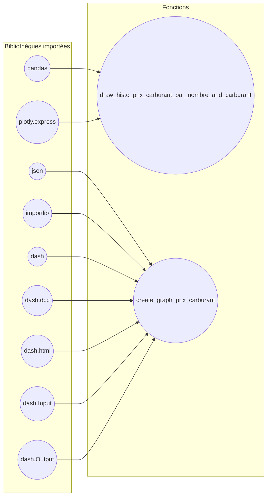
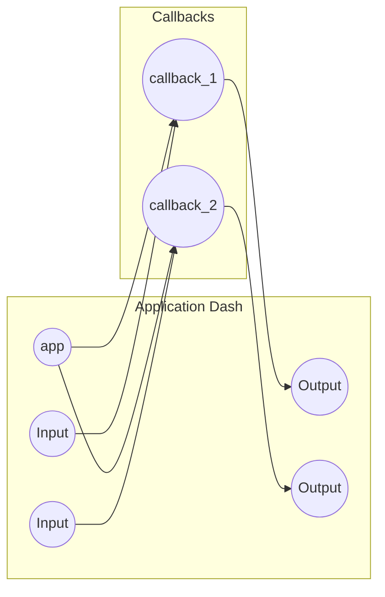

# python_E3FI_Ines_Fabien
Projet de Fabien Varoteaux-Lavigne et Inès Dakkak
# README

## User Guide

### Description

Le but de ce mini projet est de coder un dashboard en python, en prenant des données afin de les exploiter.

### Installation

Pour cloner le projet sur sa machine personnelle :

    git clone https://git.esiee.fr/varoteaf/Projet_Python_E3FI_Ines_Fabien.git

Pour les packages additionnels :

    $ python -m pip install -r requirements.txt

Les ressources statiques peuvent être téléchargées en lançant le get_data.py; quand on lance le fichier, un lien htpp est donné dans la console, il faut cliquer dessus et une page blanche s'affiche. A la suite de cela, les fichiers sont téléchargeables sous format zip.

### Utilisation

Pour utiliser le dashboard, il faut lancer le main.py.
Dans la console va s'afficher une adresse http qui a été générée après l'exécution du main. Lorsqu'on clique dessus le dashboard apparait dans la fenêtre de votre navigateur par défaut.

La première section du dashboard qui s'affiche est un histogramme du nombre de stations en France selon le prix du carburant à la vente. Pour cet histogramme, nous avons la possibilité, à l'aide du curseur, de changer la taille du regroupement de données par classe. Nous avons mis par défaut un "bin" de 6 afin de mettre en exergue les différences de prix pour un seul et même type de carburant.

Il est possible de sélectionner qu'un seul type de carburant en cliquant sur un des noms dans la légende à droite de l'histogramme.

La deuxième section du dashboard est une représentation géolocalisée représentant les prix du carburant en Ile de France. Pour représenter chaque commune, nous avons pris le prix de la station la plus chère et lui avons associé une couleur. Plus la couleur de la commune est foncée, plus le prix de vente du carburant est le plus faible (l'échelle se base sur l'ensemble des prix des stations pour ce carburant). On peut choisir le type de carburant à afficher (Gazole, SP98, E85, E10, SP95, GPLc) dans le menu déroulant.

Si on passe notre souris sur une commune, le code de celle-ci s'affiche mais également le prix maximale du carburant en vente.

Juste en dessous il y une carte représentant toute la France. Nous avons fait ce choix car nous trouvons l'affichage de la France entière intéressant, cependant le temps de charge pour toute la France étant long (parfois jusqu'à une à deux minutes selon la machine), nous avons laissé le choix à l'utilisateur d'activer ou non cet affichage. Pour cela, il peut dans le main.py, mettre la valeur de isPrintingMapFrance à False (il est par défaut sur True, mais si on peut laisser uniquement la carte de l'IDF).

### Copyright

Je déclare sur l’honneur que le code fourni a été produit par nous même.

## Rapport d'analyse

Dans le contexte particulier de la pénurie d'essence et de la hausse des prix des carburants en France, nous avons trouvé cela intéressant d'étudier la différence des prix selon la position géographique des stations, et selon le type de carburant vendu. Nous avons décidé dans un premier temps, de nous focaliser sur l'Ile de France puisque cette région est particulièrement touchée par ces hausses et pénuries. Les données ont été récupérées depuis le site du gouvernement français.

La première chose que nous avons remarqué est la ***diversité des prix*** dans une même zone géographique pour le même type de carburant. Prenons l'exemple du GPLc en Ile de France. La multitude de couleurs affichées sur la carte met en avant un problème de taille : certaines zones sont plus favorisées que d'autres. En particulier, plus nous nous rapprochons de Paris, plus les prix augmentent.

Cependant, nous avons remarqué avec la carte de la France entière, que le prix de certains carburant tel que le gazole ou encore le E10 était assez ***homogène*** en France, et plus particulièrement au Pays-de-Loire.

Ainsi, avec notre carte, un habitant d'une commune peut s'appercevoir que dans la commune limitrophe, le prix de son carburant peut être ***divisé de moitié***, ou inversement.

De plus, grâce à l'échelle des prix sur la droite de la carte, pour chaque carburant, l'utilisateur peut voir la ***fourchette de prix*** du carburant dans la France entière, ce qui peut impacter le choix de son véhicule.

## Developper Guide

Comme dit précédemment, la première ligne de code correspondant à la déclaration de la variable **isPrintingMapFrance** qui est mise à **True** pour afficher la carte de l'Ile de France et de la France; si l'utilisateur veut afficher uniquement l'IDF, il suffit de changer cette variable à **False** .

Concercant les csv, nous les avons récupérés depuis le site avec l'adresse url du site du gouvernement.

La fonction principale de notre code est **draw_histo_prix_carburant_par_nombre_and_carburant** . Elle permet de créer un histogramme en fonction du nombre de bin (nombre de regroupement par classe) choisi par l'utilisateur via le curseur. A partir de ce nombre, nous retournons un histogramme initialisé avec la fonction de Plotly **histogram** .

Ensuite, afin de ne sélectionner que l'Ile de France, nous avons créé un masque. En effet, nous avons trié les données du csv en fonction du code des communes, en sélectionnant chaque commune commençant par le code postale des 8 départements en Ile de France. Il suffit alors de traiter et de stocker les données du fichier en fonction de cette sélection. 

Par la suite, pour afficher la carte de l'Ile de France, il nous suffit de faire appel à **px.choropleth_mapbox** en renseignant les paramètres correspondant à l'Ile de France. Nous avons choisi **choropleth_mapbox** afin de pouvoir afficher des polygones de couleurs, ce qui est plus révélateur pour nos données.

Ensuite nous faisons une condition bouléenne correspondant à l'état de **isPrintingMapFrance**, si c'est vrai alors nous affichons la carte de la France de la même manière que pour l'Ile de France, juste en changeant les paramètres. 

Enfin, dans le **main**, nous avons mis les déclarations permettant d'afficher les histogrammes et cartes. Nous y avons rajouté les déclarations permettant d'afficher les composants des éléments HTML, tels que les curseurs etc. 
    
Nous y avons inclus les **@app.callback()** qui vont permettre de faire le lien entre les composants HTML qu'on modifie, par exemple lorsqu'on modifie le bin pour l'histogramme avec le curseur ou encore le type de carburant sélectionné avec les menus déroulant.
    
Enfin, nous lançons à la fin du main l'application. 

### Architecture du code

Ce schéma montre que nous avons importé plusieurs bibliothèques, dont pandas, plotly et dash, et que vous avez défini deux fonctions dans votre code : "draw_histo_prix_carburant_par_nombre_and_carburant" et "create_graph_prix_carburant". La fonction "draw_histo_prix_carburant_par_nombre_and_carburant" utilise les bibliothèques pandas et plotly, tandis que la fonction "create_graph_prix_carburant" utilise les bibliothèques json, importlib, dash, dash.dcc, dash.html, dash.Input et dash.Output.

Ce schéma montre que l'application Dash est composée de deux inputs (Input_1 et Input_2) et de deux outputs (Output_1 et Output_2). Ces inputs et outputs sont liés à deux callbacks (Callback_1 et Callback_2), qui sont des fonctions Python qui sont appelées lorsque les inputs sont modifiés ou lorsque des conditions sont remplies.

